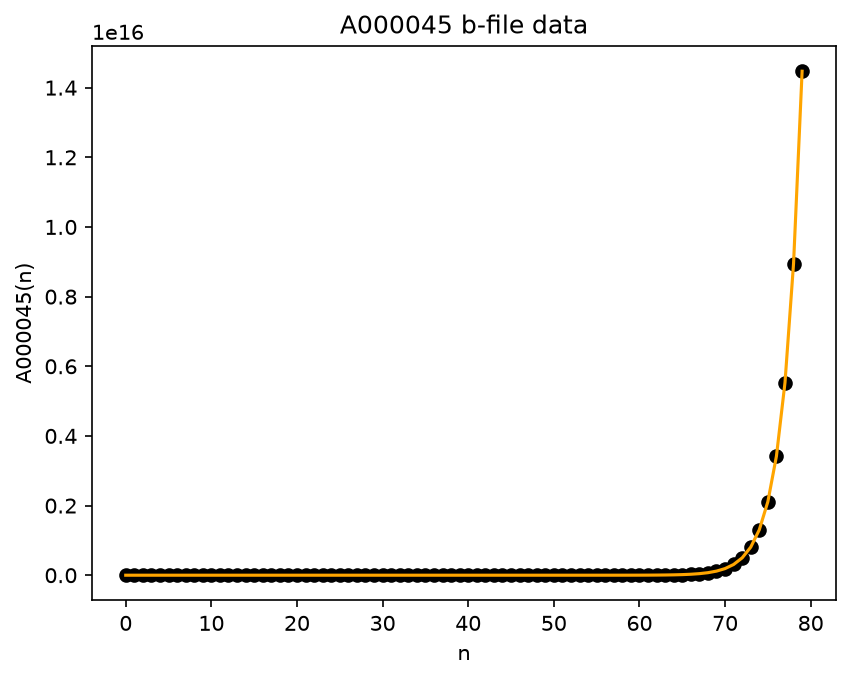

# oeis-tools

[](https://github.com/oeistools/oeis-tools/actions/workflows/tests.yml?query=branch%3Amain)
[](https://codecov.io/gh/oeistools/oeis-tools)
[](https://pypi.org/project/oeis-tools/)
[](https://pypi.org/project/oeis-tools/)
[](https://pypi.org/project/oeis-tools/)
[](https://pypi.org/project/oeis-tools/)
[](LICENSE)

A focused Python toolkit for working with [OEIS](https://oeis.org) integer sequences: fetch metadata, parse b-files, plot sequence values, and generate citations.

**Full documentation:** https://oeistools.github.io/oeis-tools/

## Table of Contents

- [Features](#features)
- [Requirements](#requirements)
- [Installation](#installation)
- [Quick Start](#quick-start)
- [Plotting Examples](#plotting-examples)
- [API Summary](#api-summary)
- [Error Behavior](#error-behavior)
- [Development](#development)
- [Publishing](#publishing)
- [License](#license)

## Features

- Validate OEIS IDs like `A000045` and build canonical OEIS URLs / b-file names
- Fetch full sequence metadata via `Sequence` (name, authors, comments, formulas, keywords, cross-references, ...)
- Look up OEIS keyword descriptions (e.g. what `nonn` or `easy` mean)
- Extract cross-referenced OEIS IDs from a sequence's `xref` field
- Generate a ready-to-use BibTeX citation for any sequence
- Download the OEIS-hosted graph image, or display it inline in Jupyter
- Fetch and parse b-file numeric data via `BFile`
- Plot b-file values with line, joined, or scatter styles (large-integer safe)
- Create your own b-file from a list of computed values with `create_bfile`

## Requirements

- Python 3.9+
- `requests` (installed automatically)
- Optional: `matplotlib` for plotting (`pip install oeis-tools[plot]`)

## Installation

```bash
pip install oeis-tools
```

With optional plotting support:

```bash
pip install "oeis-tools[plot]"
```

For local development:

```bash
git clone https://github.com/oeistools/oeis-tools.git
cd oeis-tools
python -m venv .venv
source .venv/bin/activate
pip install -e ".[dev,plot,docs]"
```

## Quick Start

### Utility Functions

```python
import oeis_tools as ot

ot.check_id("A000045")                # True
ot.oeis_bfile("A000045")              # 'b000045.txt'
ot.oeis_url("A000045")                # 'https://oeis.org/A000045'
ot.oeis_url("A000045", fmt="json")    # 'https://oeis.org/search?q=id:A000045&fmt=json'
ot.oeis_keyword_description("nonn")   # 'Displayed terms are nonnegative ...'
```

### Sequence API

`Sequence` fetches a sequence's full JSON record from OEIS and exposes it as
plain attributes, plus a few convenience methods.

```python
from oeis_tools import Sequence

seq = Sequence("A000045")

seq.id            # 'A000045'
seq.name          # 'Fibonacci numbers'
seq.data          # [0, 1, 1, 2, 3, 5, ...]
seq.author        # ['N. J. A. Sloane', ...]
seq.keyword       # ['nonn', 'core', 'easy', 'nice']
seq.offset        # [0, 2]
seq.comment       # comments, joined with newlines
seq.formula       # formulas, joined with newlines
seq.xref          # cross-reference text
seq.link          # parsed links as Markdown-style text
seq.created       # datetime | None
seq.time          # datetime | None, last modification

# Convenience methods
seq.get_data_values()             # [0, 1, 1, 2, 3, 5, ...] (re-parsed as ints)
seq.get_xref_ids()                # ['A000032', 'A000204', ...]
seq.get_keyword_description("nonn")
seq.get_bfile_info()              # dict: availability + basic stats
seq.get_bibtex()                  # BibTeX @misc citation, see below
seq.get_graph_png()               # raw PNG bytes of the OEIS graph
seq.get_graph_image()             # IPython.display.Image in notebooks, else bytes
```

### Citing a Sequence

`get_bibtex()` builds a ready-to-paste BibTeX entry, including authors, the
creation date (year/month/day, when known), the title prefixed with the OEIS
ID, and the entry's URL:

```python
print(seq.get_bibtex())
```

```bibtex
@misc{A000045,
  author       = {N. J. A. Sloane},
  title        = {A000045: Fibonacci numbers},
  howpublished = {The {O}n-{L}ine {E}ncyclopedia of {I}nteger {S}equences},
  year         = {1964},
  month        = jan,
  day          = {01},
  date         = {1964-01-01},
  url          = {https://oeis.org/A000045}
}
```

### B-file API

```python
from oeis_tools import BFile

bfile = BFile("A000045")

bfile.get_filename()      # 'b000045.txt'
bfile.get_url()           # 'https://oeis.org/A000045/b000045.txt'
bfile.get_bfile_data()    # list[int] | None
bfile.get_bfile_indices() # list[int] | None, the b-file's first column

bfile.plot_data(50, show=False)                         # first 50 points
bfile.plot_data(50, show=False, plot_style="scatter")    # scatter plot
bfile.plot_data(50, show=False, plot_style="joined")     # joined/line plot
ax = bfile.plot_data(show=False, return_ax=True)         # matplotlib Axes
```

### Creating a B-file

If you compute your own sequence, write it out in the standard OEIS b-file
format (`n a(n)`, one pair per line):

```python
from oeis_tools.bfile import create_bfile

my_sequence = [1, 2, 3, 5, 8, 13]
create_bfile("A213676", my_sequence, offset=1)  # writes b213676.txt
```

## Plotting Examples

Overlay two sequences on one plot:

```python
import matplotlib.pyplot as plt
from oeis_tools import BFile

N_POINTS = 200

bfile = BFile("A114906")
bfile2 = BFile("A114904")
fig, ax = plt.subplots()
bfile.plot_data(n=N_POINTS, ax=ax, show=False, color="red")
bfile2.plot_data(n=N_POINTS, ax=ax, show=True, color="blue")
plt.show()
```

Scatter versus joined:

```python
import matplotlib.pyplot as plt
from oeis_tools import BFile

bfile = BFile("A000045")
fig, ax = plt.subplots()
bfile.plot_data(80, ax=ax, show=False, plot_style="scatter", color="black")
bfile.plot_data(80, ax=ax, show=False, plot_style="joined", color="orange")
plt.show()
```



## API Summary

**Module-level utilities** (`oeis_tools`)

- `check_id(oeis_id: str) -> bool`
- `oeis_bfile(oeis_id: str) -> str`
- `oeis_url(oeis_id: str, fmt: str | None = None) -> str`
- `oeis_keyword_description(keyword_tag: str | None) -> str | None`

**`Sequence(oeis_id: str)`**

- `.get_data_values() -> list[int]`
- `.get_xref_ids() -> list[str]`
- `.get_keyword_description(keyword_tag: str) -> str | None`
- `.get_bfile_info() -> dict`
- `.get_bibtex() -> str`
- `.get_graph_png(*, timeout=10, use_cache=True) -> bytes`
- `.get_graph_image(*, width=None, height=None, timeout=10, use_cache=True) -> IPython.display.Image | bytes`

**`BFile(oeis_id: str)`**

- `.get_filename() -> str`
- `.get_url() -> str`
- `.get_bfile_data() -> list[int] | None`
- `.get_bfile_indices() -> list[int] | None`
- `.plot_data(n=None, show=True, ax=None, return_ax=False, plot_style="line", **plot_kwargs) -> matplotlib.axes.Axes | None`

**`create_bfile(oeis_id: str, data: list[int], offset: int = 1, output_path: str | None = None) -> str`**
(module: `oeis_tools.bfile`)

## Error Behavior

- `Sequence(...)` raises `ValueError` for invalid OEIS IDs.
- `Sequence(...)` propagates HTTP errors from the OEIS JSON endpoint.
- `Sequence.get_graph_png()` / `.get_graph_image()` propagate HTTP errors from OEIS.
- `BFile.get_bfile_data()` returns `None` when a b-file cannot be fetched or parsed.
- `BFile.plot_data(...)` raises `ValueError` when no b-file data is available, and
  `ImportError` when `matplotlib` is not installed.

## Development

Set up the environment (see [Installation](#installation) above), then:

```bash
# Run the test suite (coverage is enabled via pyproject.toml)
pytest -q

# Format and lint
ruff format .
ruff check . --fix

# Build and verify distributions
python -m build
python -m twine check dist/*
```

Optionally install the pre-commit hooks (whitespace/YAML/TOML checks, ruff)
so they run automatically on every commit:

```bash
pre-commit install
```

Contribution guide: see [`CONTRIBUTING.md`](CONTRIBUTING.md).

## Publishing

This repository includes a GitHub Actions publish workflow at
[`.github/workflows/publish.yml`](.github/workflows/publish.yml).

- Automatic publish trigger: GitHub Release `published`
- Manual publish trigger: `workflow_dispatch`
- Upload target: PyPI via trusted publishing (`id-token`)

## License

MIT. See [`LICENSE`](LICENSE).
